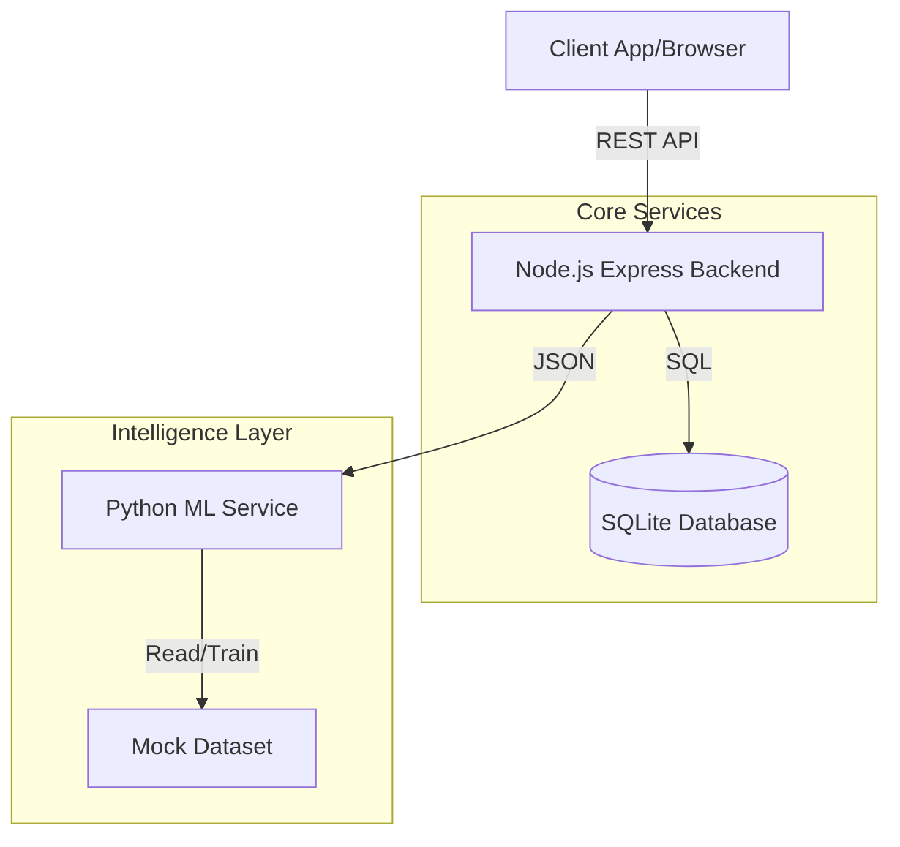

# System Architecture

## Overview
The Sleeper Bus Booking System follows a **Microservices-lite Architecture**, separating the Core Booking Engine (Node.js) from the Data Science/Prediction Engine (Python).

## High-Level Diagram

## Technology Choices

### Backend: Node.js + Express
- **Why?** Non-blocking I/O is ideal for booking systems with high concurrency.
- **Framework:** Express.js for simplicity and standard middleware support.
- **ORM:** Sequelize for database abstraction and schema management.
- **Database:** SQLite (Development) / PostgreSQL (Production). SQLite was chosen for this assignment to ensure zero-setup portability.

### Machine Learning: Python + Flask
- **Why?** Python is the native language of Data Science.
- **Library:** Scikit-learn (Random Forest) for robust classification on tabular data.
- **Integration:** Exposed via Flask API to decouple it from the main backend.

## Data Flow

### Booking Flow
1. **Search:** Client `GET /seats`. Backend queries `Seats` joined with `BookingSeats` to calculate availability (checking overlaps).
2. **Locking:** Backend uses transactions to ensure atomic booking.
3. **Creation:** Booking record created -> Seat segments locked -> Meals recorded.

### Overlap Logic (The Core Algorithm)
To support multi-station bookings (e.g., A->B, B->C), we use an interval intersection check:
- Seat S is booked for interval `[Start_Existing, End_Existing]`.
- User requests `[Start_New, End_New]`.
- **Conflict Condition:** `Start_New < End_Existing AND End_New > Start_Existing`.
- This ensures that if a seat is free A->B and C->D, it remains bookable for those segments.

## Security & Scalability
- **Security:** Input validation via `Joi`. Error masking in production. (Future: JWT Auth).
- **Scalability:** The stateless API can be horizontally scaled. Database can be migrated to RDS/Postgres.
